# I Built a Personal AI News Anchor in 90 Minutes (by Arguing with an LLM)

I have 11 years of experience in IT, but keeping up with the "firehose" of AI news is becoming a full-time job. I have exactly four 15-minute walking intervals a day to catch up. I didn't need another news app; I needed a signal filter.

Instead of searching for a pre-made tool, I decided to pair-program a custom solution with an AI. My goal wasn't just to write code, but to treat the LLM as a Junior Architect—debating trade-offs, refining requirements, and building a "News-to-Speech" pipeline.

## 🎯 The Objective
Convert high-signal AI news (Hacker News) into a 15-minute audio briefing for daily walks, filtering out fluff and strictly preserving technical depth. This system is designed to be "pull-on-demand" via a mobile bookmark.

## 🏗️ The Architecture

### The Stack
* **Orchestrator:** n8n (Self-hosted)
* **Intelligence:** OpenAI (GPT-4o & TTS-1)
* **Trigger:** Webhook (Browser Bookmark)

### Logic Flow
1.  **Trigger:** I click a bookmark on my phone 📱 → Hits n8n Webhook.
2.  **Ingest:** HTTP Request pulls **Hacker News RSS**.
3.  **Smart Filter (The Gatekeeper):** An LLM evaluates titles and outputs structured JSON (e.g., `{"relevant": true}`).
4.  **Extraction:** **HTML-to-Markdown** converts the article, stripping ads but keeping code blocks.
5.  **Fork (Parallel Execution):**
    * **Branch A (Audio):** An LLM writes a script describing the code logic, which OpenAI TTS converts to MP3. This streams directly to my phone.
    * **Branch B (Archive):** The raw Markdown (with code blocks) is saved to my GitHub repo for deep diving later.

## 🧠 Architectural Decision Log

### 1. The Filtering Strategy: Keywords vs. Concepts
**The Conflict:** My first instinct was to use a simple `IF` node: *If title contains 'AI', keep it.* But this approach is brittle.
* **The "Missed Signal" Risk:** If a groundbreaking paper comes out titled *"Optimizing Sparse Matrices for Transformer Architecture,"* a keyword filter looking for "AI" will trash it.
* **The "Reliability" Problem:** Conversely, a press release titled *"Our new Toaster now has AI!"* would pass the filter, cluttering my walk.

**The Resolution:** I chose to use an **LLM Classifier**. By sending the title to a model with the prompt *"Is this highly technical software news?"*, I trade a small API cost for semantic understanding. The model knows that "Mamba Architecture" is relevant, even if the acronym "AI" never appears.

### 2. The Cleaning Strategy: Intelligence vs. Engineering
**The Conflict:** My initial thought was to use an **AI Agent** to "read" the webpage and extract the main content.
* **The Problem:** Sending 100kb of raw HTML (full of ad scripts) to an LLM is a massive waste of tokens and adds latency.

**The Resolution:** I opted for a "dumb" tool: an **HTML-to-Markdown converter**. It strips 90% of the characters (the noise) while preserving 100% of the signal (headers, code blocks) deterministically, without hallucination risks.

### 3. The Delivery Strategy: Apps vs. Streams
**The Conflict:** The "proper" engineering solution would be to build a mobile app or a Telegram bot. But that introduces friction (auth, updates, UI). I just want to walk out the door and listen.

**The Resolution:** I chose a **Browser Stream**. I set up an n8n Webhook that returns a binary audio file.
* **The Workflow:** Click Bookmark → n8n runs logic → Audio starts playing in the browser.
* **The Payoff:** Zero UI to build, zero apps to maintain.

## 📊 System Diagram

```mermaid
graph TD
    %% Nodes
    Trigger[📱 Webhook Trigger] --> Fetch[HTTP Request: RSS]
    Fetch --> Filter[🧠 AI Agent: Filter]
    
    %% Logic Split
    Filter -- Yes --> Extract[HTML to Markdown]
    Filter -- No --> End[Stop]
    
    %% Extraction
    Extract --> Fork{Parallel Fork}
    
    %% Branch A: Audio
    Fork -- Audio --> Summarize[LLM: Audio Script]
    Summarize --> TTS[OpenAI TTS]
    TTS --> Stream[🔊 Stream to Phone]
    
    %% Branch B: Archive
    Fork -- Archive --> Save[💾 Save to GitHub Repo]
    
    %% Styling
    style Filter fill:#f9f,stroke:#333,stroke-width:2px
    style Fork fill:#bbf,stroke:#333,stroke-width:2px
```

